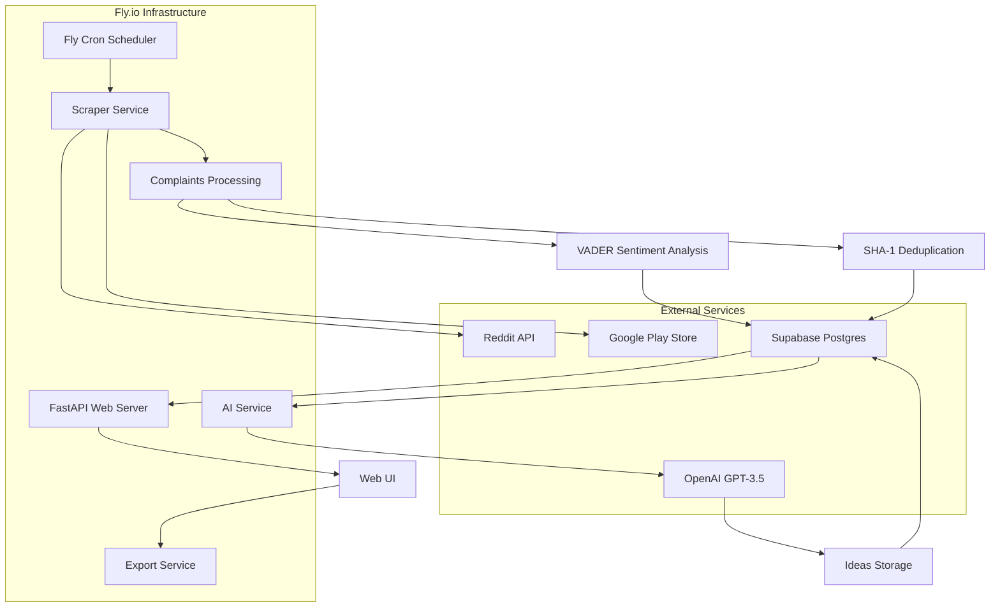

# Design Document

## Overview

App Idea Hunter is a cloud-native web application built with FastAPI that automatically discovers startup opportunities by mining complaints from Reddit and Google Play Store reviews. The system uses sentiment analysis to filter genuine pain points, leverages GPT-3.5 to generate scored startup ideas, and provides a responsive web interface for browsing and exporting results. The architecture is designed for cost-effective solo usage with automatic scaling capabilities.

## Architecture

### High-Level Architecture



### Deployment Architecture

The application runs on Fly.io with scale-to-zero capability:
- **Container**: Docker-based FastAPI application
- **Scaling**: Automatic scale from 0 to 1+ instances based on traffic
- **Scheduling**: Fly cron triggers daily scraping at 2 AM UTC
- **Secrets**: Environment variables managed through Fly secrets store
- **Database**: Supabase Postgres Free tier with automatic backups

## Components and Interfaces

### 1. Scraper Service (`app/scrapers/`)

**Purpose**: Asynchronously collect complaints from multiple sources

**Key Components**:
- `reddit_scraper.py`: Handles Reddit posts and comments via Reddit API
- `google_play_scraper.py`: Scrapes 1-3 star reviews from Google Play Store
- `base_scraper.py`: Abstract base class with common retry logic and error handling

**Interfaces**:
```python
class BaseScraper:
    async def scrape(self) -> List[Complaint]
    async def _retry_request(self, url: str, max_retries: int = 3) -> httpx.Response
    def _handle_rate_limit(self, response: httpx.Response) -> None
```

**Error Handling**:
- Exponential backoff for rate limits and temporary failures
- Failed URLs stored in `errors` table with timestamps and error details
- Graceful degradation - continues processing even if some sources fail

### 2. Data Processing Service (`app/services/`)

**Purpose**: Filter, deduplicate, and process raw complaints

**Key Components**:
- `sentiment_analyzer.py`: VADER sentiment analysis implementation
- `deduplication_service.py`: SHA-1 based duplicate detection
- `complaint_processor.py`: Orchestrates the processing pipeline

**Processing Pipeline**:
1. Raw complaint text input
2. VADER sentiment analysis (filter < -0.3)
3. Generate SHA-1 hash of first 120 tokens
4. Check for existing hash in database
5. Store unique, negative sentiment complaints

### 3. AI Integration Service (`app/services/ai_service.py`)

**Purpose**: Generate startup ideas using GPT-3.5 with structured prompts

**Key Features**:
- Template-based prompting from `prompts/idea_prompt.txt`
- JSON response parsing with validation
- Cost tracking and token usage monitoring
- Batch processing for efficiency

**Response Structure**:
```json
{
  "idea": "Concise app idea under 35 words",
  "score_market": 8,
  "score_tech": 6,
  "score_competition": 7,
  "score_monetisation": 5,
  "score_feasibility": 9,
  "score_overall": 7
}
```

### 4. Web Interface (`app/routes/` and templates)

**Purpose**: Provide responsive UI for browsing, filtering, and exporting ideas

**Key Features**:
- Server-side rendered HTML with FastAPI Jinja2 templates
- HTMX for dynamic interactions (pagination, filtering, favorites)
- Alpine.js for client-side state management
- Tailwind CSS for responsive styling

**Views**:
- Table view: Compact data display with sortable columns
- Card view: Visual idea cards with scoring metrics
- Export view: PDF and CSV generation interface

### 5. Export Service (`app/services/export_service.py`)

**Purpose**: Generate PDF and CSV exports of filtered idea lists

**Features**:
- Filtered data export based on user selections
- PDF generation with formatted layouts
- CSV export with all data fields
- Asynchronous processing for large datasets

## Data Models

### Database Schema (Supabase Postgres)

```sql
-- Raw scraped complaints with metadata
CREATE TABLE complaints (
    id UUID PRIMARY KEY DEFAULT gen_random_uuid(),
    source VARCHAR(50) NOT NULL, -- 'reddit' or 'google_play'
    source_url TEXT,
    content TEXT NOT NULL,
    content_hash VARCHAR(40) UNIQUE, -- SHA-1 of first 120 tokens
    sentiment_score FLOAT,
    scraped_at TIMESTAMP DEFAULT NOW(),
    metadata JSONB -- source-specific data
);

-- AI-generated ideas with scoring
CREATE TABLE ideas (
    id UUID PRIMARY KEY DEFAULT gen_random_uuid(),
    complaint_id UUID REFERENCES complaints(id),
    idea_text TEXT NOT NULL,
    score_market INTEGER CHECK (score_market BETWEEN 1 AND 10),
    score_tech INTEGER CHECK (score_tech BETWEEN 1 AND 10),
    score_competition INTEGER CHECK (score_competition BETWEEN 1 AND 10),
    score_monetisation INTEGER CHECK (score_monetisation BETWEEN 1 AND 10),
    score_feasibility INTEGER CHECK (score_feasibility BETWEEN 1 AND 10),
    score_overall INTEGER CHECK (score_overall BETWEEN 1 AND 10),
    raw_response JSONB, -- Full GPT response
    tokens_used INTEGER,
    generated_at TIMESTAMP DEFAULT NOW(),
    is_favorite BOOLEAN DEFAULT FALSE
);

-- Tracking scraping sources and metadata
CREATE TABLE sources (
    id UUID PRIMARY KEY DEFAULT gen_random_uuid(),
    source_type VARCHAR(50) NOT NULL,
    source_identifier TEXT NOT NULL, -- subreddit name, app package, etc.
    last_scraped TIMESTAMP,
    is_active BOOLEAN DEFAULT TRUE,
    config JSONB -- source-specific configuration
);

-- Failed scraping attempts for debugging
CREATE TABLE errors (
    id UUID PRIMARY KEY DEFAULT gen_random_uuid(),
    source VARCHAR(50) NOT NULL,
    url TEXT,
    error_message TEXT,
    error_type VARCHAR(100),
    occurred_at TIMESTAMP DEFAULT NOW(),
    retry_count INTEGER DEFAULT 0
);
```

### SQLModel Classes

```python
class Complaint(SQLModel, table=True):
    id: Optional[UUID] = Field(default_factory=uuid4, primary_key=True)
    source: str
    source_url: Optional[str] = None
    content: str
    content_hash: str = Field(unique=True)
    sentiment_score: Optional[float] = None
    scraped_at: datetime = Field(default_factory=datetime.utcnow)
    metadata: Optional[Dict] = Field(default=None, sa_column=Column(JSON))

class Idea(SQLModel, table=True):
    id: Optional[UUID] = Field(default_factory=uuid4, primary_key=True)
    complaint_id: UUID = Field(foreign_key="complaint.id")
    idea_text: str
    score_market: int = Field(ge=1, le=10)
    score_tech: int = Field(ge=1, le=10)
    score_competition: int = Field(ge=1, le=10)
    score_monetisation: int = Field(ge=1, le=10)
    score_feasibility: int = Field(ge=1, le=10)
    score_overall: int = Field(ge=1, le=10)
    raw_response: Optional[Dict] = Field(default=None, sa_column=Column(JSON))
    tokens_used: Optional[int] = None
    generated_at: datetime = Field(default_factory=datetime.utcnow)
    is_favorite: bool = Field(default=False)
```

## Error Handling

### Scraper Error Handling
- **Rate Limiting**: Exponential backoff with jitter (1s, 2s, 4s, 8s delays)
- **Network Failures**: Retry up to 3 times with different user agents
- **API Errors**: Log detailed error information and continue with other sources
- **Data Validation**: Skip malformed responses and log validation errors

### AI Service Error Handling
- **API Failures**: Retry with exponential backoff, fallback to queuing for later
- **Invalid JSON**: Log parsing errors and attempt to extract partial data
- **Cost Overruns**: Implement circuit breaker when approaching token limits
- **Timeout Handling**: Set reasonable timeouts and handle gracefully

### Database Error Handling
- **Connection Failures**: Implement connection pooling with retry logic
- **Constraint Violations**: Handle duplicate entries gracefully
- **Transaction Failures**: Rollback and retry with exponential backoff
- **Migration Issues**: Provide clear error messages and recovery steps

### Web Interface Error Handling
- **404 Errors**: Custom error pages with navigation options
- **500 Errors**: Graceful degradation with user-friendly messages
- **Export Failures**: Provide feedback and retry options
- **Session Management**: Handle expired sessions gracefully

## Testing Strategy

### Unit Testing
- **Scrapers**: Mock HTTP responses and test parsing logic
- **Data Processing**: Test sentiment analysis and deduplication algorithms
- **AI Service**: Mock OpenAI responses and test JSON parsing
- **Database Models**: Test validation and relationship constraints

### Integration Testing
- **End-to-End Scraping**: Test complete scraping pipeline with test data
- **Database Integration**: Test all CRUD operations with real database
- **AI Integration**: Test with OpenAI sandbox environment
- **Export Functionality**: Test PDF and CSV generation with sample data

### Cost Guard Testing
- **Token Usage Monitoring**: Automated tests to ensure mean tokens per complaint < 600
- **Cost Calculation**: Verify cost estimates match actual usage
- **Threshold Alerts**: Test cost monitoring and alerting mechanisms

### Performance Testing
- **Concurrent Scraping**: Test async scraping performance under load
- **Database Performance**: Test query performance with large datasets
- **UI Responsiveness**: Test pagination and filtering with 10,000+ records
- **Export Performance**: Test large dataset export capabilities

### Deployment Testing
- **Fly.io Deployment**: Automated deployment testing in staging environment
- **Environment Variables**: Test secret management and configuration
- **Scaling**: Test scale-to-zero and scale-up behavior
- **Cron Jobs**: Test scheduled scraping functionality

### Monitoring and Observability
- **Structured Logging**: JSON logs with correlation IDs for request tracing
- **Metrics Collection**: Track scraping success rates, processing times, costs
- **Health Checks**: Endpoint for monitoring service health
- **Error Tracking**: Centralized error logging with alerting capabilities